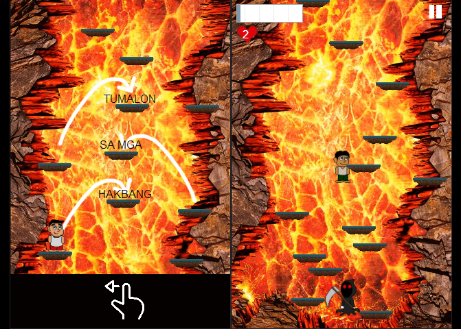

<!DOCTYPE html>
<html lang="en">

<head>
    <meta charset="UTF-8" />
    <meta http-equiv="X-UA-Compatible" content="IE=edge" />
    <meta name="viewport" content="width=device-width, initial-scale=1.0" />
    <title>Kate Jermina</title>
    <link rel="shortcut icon" type="image/png" href="images/favicon.ico" />
    <meta name="description" content="Kate Jermina | Portfolio. Connect with me if you want to collaborate for projects!">
    <meta name="keywords" content="portfolio, web developer, it">
    <meta name="author" content="Kate Jermina">
    <link rel="stylesheet" href="https://maxcdn.bootstrapcdn.com/bootstrap/4.0.0/css/bootstrap.min.css" integrity="sha384-Gn5384xqQ1aoWXA+058RXPxPg6fy4IWvTNh0E263XmFcJlSAwiGgFAW/dAiS6JXm" crossorigin="anonymous">
    <link rel="stylesheet" href="css/styles.css" />
</head>

<body>
    

        <header>
            

                <a href="#">
                    
katejermina

                </a>
                

                    
                

                

                    <a href="#home" class="nav-link">Home</a>
                    <a href="#about" class="nav-link">About</a>
                    <a href="#work" class="nav-link">Experiences</a>
                    <a href="#history" class="nav-link">Works</a>
                    <a href="#contact" class="nav-link">Contact</a>
                

            

        </header>
        

            <a href="#home" class="nav-link">Home</a>
            <a href="#about" class="nav-link">About</a>
            <a href="#work" class="nav-link">Experiences</a>
            <a href="#history" class="nav-link">Works</a>
            <a href="#contact" class="nav-link">Contact</a>
        

        

            

                

                    

                        

                            <h1 class="index-greeting hello">Hello 
                                
world!

                            </h1>
                        

                        

                            
My name is Kate   & I'm an aspiring  
                                <b class="career">Web developer</b>
                            

                            <a href="#about" class="index-scroll">
                                

                                    <i class="arrow-down"></i>
                                

                            </a>
                            <a href="#" class="index-scroll-up">
                                

                                    <i class="arrow-up"></i>
                                

                            </a>
                            <a href="#" class="index-scroll-up-full">
                                

                                    <i class="arrow-up"></i>
                                

                            </a>
                        

                    

                

                

                

            

            

                

                    

                        <h1 class="content-h1">About</h1>
                        

                            

                                
                            

                            

                                

                                    My name is Kate Jermina. I've been an IT professional for 2 years now. I have a degree in Information Technology with Latin honors, and planning to pursue higher education in the near future.
                                      The College organization I was a part of served as my training ground for my current career. My early projects made me exhibit my creativity, critical thinking, and collaboration towards others--I figured, I can fit in front-end or back-end.
                                      Eventually, I was given an opportunity to have a role in Devops. Now, I carry the continuous drive for excellence in cloud computing.
                                

                                

                                    <button type="button" class="btn">See my <a href="/resume/Kate-Jermina-Resume.pdf" class="contact-resume">résumé</a> </button>
                                

                            

                        

                    

                

                

                

                    

                        <h1 class="">Journey</h1>
                        

                            

                                

                                    Technologies I have used
                                

                                

                                    
                                    
                                    
                                    
                                    
                                    
                                    
                                    
                                    
                                    
                                    
                                    
                                    
                                    
                                    
                                    
                                    
                                    
                                

                            

                            

                                

                                    

                                        Companies I have worked with
                                    

                                    

                                        
                                        
                                    

                                

                                 
                                

                                    
Certifications

                                    

                                        
                                        
Microsoft Certified: AZ-900 / Azure Fundamentals

                                    

                                

                            

                        

                    

                

                

                

                    

                        <h1 class="content-h1">Projects</h1>
                        

                            

                                <a href="#modal-capstone">
                                    

                                        
1

                                        
Capstone Project:   Web-based Appointment Scheduling System with SMS Notification & Interactive Directory

                                    

                                </a>
                                

                                    

                                        <a href="#history" class="modal-close">&times;</a>
                                        

                                            

                                                

                                                    
                                                

                                                

                                                    
                                                

                                                

                                                    
                                                

                                                

                                                    
                                                

                                                

                                                    
                                                

                                            

                                            <a class="carousel-control-prev" href="#carousel-capstone" role="button" data-slide="prev">
                                                
                                                Previous
                                            </a>
                                            <a class="carousel-control-next" href="#carousel-capstone" role="button" data-slide="next">
                                                
                                                Next
                                            </a>
                                        

                                        

                                            
Intended platform: Touchscreen device/Desktop

                                            
Technologies used: HTML, CSS, Javascript, JQuery, PHP, MySQL, XAMPP, Corel Draw, Photoshop, Lightroom

                                            
Keywords: Content Management System, Appointment Scheduling System, Mapping System, SMS 

                                        

                                    

                                

                            

                            

                                <a href="#modal-speech">
                                    

                                        
2

                                        
Mathalino:   Mathematical Game with Speech Recognition

                                    

                                </a>
                                

                                    

                                        <a href="#history" class="modal-close">&times;</a>
                                        

                                            

                                                

                                                    
                                                

                                                

                                                    
                                                

                                                

                                                    
                                                

                                                

                                                    
                                                

                                                

                                                    
                                                

                                                

                                                    
                                                

                                                

                                                    
                                                

                                            

                                            <a class="carousel-control-prev" href="#carousel-mathalino" role="button" data-slide="prev">
                                                
                                                Previous
                                            </a>
                                            <a class="carousel-control-next" href="#carousel-mathalino" role="button" data-slide="next">
                                                
                                                Next
                                            </a>
                                        

                                        
Technologies/Software used: Visual Basic, MySQL, Speech Synthesizer (VB .Net), Microsoft Visual Studio

                                        
Keywords: Edutainment, Game, Interactive, Speech Recognition 

                                    

                                

                            

                            

                                <a href="#modal-game">
                                    

                                        
3

                                        
(Non-Commercial) Platform Game:   Misadventures of Bakal Bote Boys

                                    

                                </a>
                            

                            

                                

                                    <a href="#history" class="modal-close">&times;</a>
                                    

                                        

                                            

                                                

                                                    
                                                

                                                

                                                    
                                                

                                                

                                                    
                                                

                                                

                                                    
                                                

                                                

                                                    
                                                

                                            

                                        

                                        <a class="carousel-control-prev" href="#carousel-game" role="button" data-slide="prev">
                                            
                                            Previous
                                        </a>
                                        <a class="carousel-control-next" href="#carousel-game" role="button" data-slide="next">
                                            
                                            Next
                                        </a>
                                    

                                    

                                        

                                            

                                                

                                                    
                                                

                                                

                                                    
                                                

                                                

                                                    
                                                

                                                

                                                    
                                                

                                                

                                                    
                                                

                                                

                                                    
                                                

                                            

                                            <a class="carousel-control-prev" href="#carousel-game-device" role="button" data-slide="prev">
                                                
                                                Previous
                                            </a>
                                            <a class="carousel-control-next" href="#carousel-game-device" role="button" data-slide="next">
                                                
                                                Next
                                            </a>
                                        

                                    

                                    
Technologies/Software used: Stencyl, Photoshop 

                                    
Keywords: Platform game, Stencyll, Game Development 

                                

                            

                        

                    

                

            

            

                

                    

                        

                            
                            
                            
                            
                            
                        

                        

                            
©&nbspKate Jermina&nbsp&nbsp&nbsp2021  

                        

                    

                    

                        

                            
<a class="credits">©&nbspKate Jermina</a> &nbsp2021

                        

                        

                            
                            
                            
                            
                            
                        

                        

                            

                                Manila, Philippines
                            

                        

                    

                

            

        

    

    

    
    
    
    
    
    
    <!--  -->

</body>
</html>
